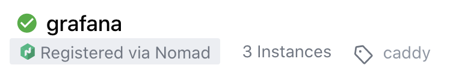

# caddy-consul

Config generation from Consul services Plugin for [Caddy v2](https://github.com/caddyserver/caddy).

This plugin was inspired by the way [Fabio](https://fabiolb.net/) works, and brings automatic
and almost instant reverse proxying Consul services with Caddy.

Disclaimer: this plugin is still development stage and, despite being used as the main load balancer for the services
of our internal Nomad clusters, probably assumes some configuration parts and miss some features.

As this plugin generates the `caddytls` and `caddyhttp` apps configuration from Consul services,
it imports and offers a basic integration with the following plugins based on Consul tags:
* [caddy-auth-portal](https://github.com/greenpau/caddy-auth-portal)
* [caddy-auth-jwt](https://github.com/greenpau/caddy-auth-jwt)
* [caddy-request-id](github.com/lolPants/caddy-requestid)

## Table of Contents

* [Overview](#overview)
* [Loading Caddy's configuration from Consul](#loading-caddys-configuration-from-consul)
* [Keeping the configuration up-to-date](#keeping-the-configuration-up-to-date)
* [Auto reverse-proxying](#auto-reverse-proxying)
* [Support for third party plugins](#support-for-third-party-plugins)

## Overview

This plugin enables realtime and automatic configuration updates of Caddy v2 by watching Consul K/V store and services.

The plugin registers to two Consul resources:
- a `K/V store key` that stores the global Caddy config part (`admin`, `logging`, `storage`, `apps`)
- the `services`

When the K/V store is updated or the services change, the plugin (re)generates the `http` and `tls` apps configuration 
corresponding to each service containing a specific tag in Consul, merges the two apps configurations to the global one
it got from the K/V store, and pass it to Caddy as JSON as you would do by calling the `/load` endpoint.

Since the plugin generates the `http` and `tls` configuration, all directives from these apps set another way will be
overridden by this plugin.

## Loading Caddy's configuration from Consul

Let's say with start Caddy with this extremely simple configuration:
```
{
    "apps": {
        "consul": {
            "consul_global_config_key": "configs/caddy/caddy.json",
            "consul_server": {
                "address": "127.0.0.1:8500",
                "scheme": "http",
            }
        }
    }
}
```

We only configure Caddy's `consul` app (AKA this plugin):
- we specify how to reach our Consul server
- we define the Consul K/V entry that contains the configuration

Now, if the Consul K/V entry contains the following JSON payload:
```
{
    "apps": {
        "http": {
            "servers": {
                "hello": {
                    "listen": [":2015"],
                    "routes": [
                        {
                            "handle": [{
                                "handler": "static_response",
                                "body": "Hello, world!"
                            }]
                        }
                    ]
                }
            }
        }
    }
}
```

The plugin will load this content and replace Caddy's running configuration with it.

The new configuration doesn't contain the `consul` app, so Caddy will stop it.
This is the equivalent of Caddy's built-in [HTTPLoader](https://caddyserver.com/docs/json/admin/config/load/http/),
but for Consul.

## Keeping the configuration up-to-date

If we use the same example as before, but store this JSON in our Consul K/V entry:
```
{
    "apps": {
        "consul": {
            "consul_global_config_key": "configs/caddy/caddy.json",
            "consul_server": {
                "address": "127.0.0.1:8500",
                "scheme": "http",
            }
        },
        "http": {
            "servers": {
                "hello": {
                    "listen": [":2015"],
                    "routes": [
                        {
                            "handle": [{
                                "handler": "static_response",
                                "body": "Hello, world!"
                            }]
                        }
                    ]
                }
            }
        }
    }
}
```

Here, we kept the configuration for the `consul` app, which means Caddy will keep it running.
The next time the K/V entry is updated, the plugin will detect it and update the configuration again.

## Auto reverse-proxying

Now, keeping a static configuration up-to-date is nice, but what if we could automatically generate a reverse-proxy
configuration from Consul services and their health checks?

Let's add a few things to our configuration:
```
{
    "apps": {
        "consul": {
            "consul_global_config_key": "configs/caddy/caddy.json",
            "consul_server": {
                "address": "127.0.0.1:8500",
                "scheme": "http",
            },
            "auto_reverse_proxy": {
                "consul_services_tag": "caddy",
                "default_http_server_options": {
                    "zone": "my-awesome-domain.io",
                    "http_port": 80,
                    "https_port": 443
                },
                "tls_issuers": [{
                    "module": "acme",
                    "email": "sysadmin@example.com",
                    "challenges": {
                        "dns": {
                            "ttl": 0,
                            "propagation_timeout": 0,
                            "resolvers": ["1.1.1.1"],
                            "provider": {
                                "name": "googleclouddns",
                                "gcp_project": "my-project-123456"
                            }
                        }
                    }
                }]
            }
        }
    }
}
```

Now, let's say we register a Grafana service in Consul with three instances and give it a tag `caddy`:



_Note: we used the tight integration between Nomad and Consul to register our service, but this works without Nomad._


As you'll notice, in our configuration, we added the following statement `"consul_services_tag": "caddy"`.
This is the services filtering tag that correspond to the tag we attributed to our `grafana` service in Consul.

The plugin will have the following default behavior:
- create a new hostname for `grafana`.`my-awesome-domain.io` ([consul.service_name].[default_http_server_options.zone])
- fetch the healthy instances of the Consul service and set them as the reverse proxy upstreams
- generate the TLS configuration for the domain `grafana.my-awesome-domain.io` and build the certificate with the 
provider defined in the `tls_issuers` block.

Resulting in the following configuration passed to Caddy:
```
{
    "apps": {
        "http": {
            "servers": {
                "http": {
                    "listen": [":80"]
                },
                "https": {
                    "listen": [":443"],
                    "routes": [{
                        "match": [{
                                "host": ["grafana.my-awesome-domain.io"]
                            }
                        ],
                        "handle": [{
                            "handler": "reverse_proxy",
                            "upstreams": [{
                                "dial": "127.0.0.1:24250"
                            },
                            {
                                "dial": "127.0.0.1:27372"
                            },
                            {
                                "dial": "127.0.0.1:31830"
                            }]
                        }],
                        "terminal": true
                    }]
                }
            }
        },
        "tls": {
            "automation": {
                "policies": [{
                    "subjects": [
                        "grafana.my-awesome-domain.io"
                    ],
                    "issuers": [{
                        "module": "acme",
                        "email": "sysadmin@example.com",
                        "challenges": {
                            "dns": {
                                "ttl": 0,
                                "propagation_timeout": 0,
                                "resolvers": [
                                    "1.1.1.1"
                                ],
                                "provider": {
                                    "name": "googleclouddns",
                                    "gcp_project": "my-project-123456"
                                }
                            }
                        }
                    }]
                }]
            }
        }
    }
}
```

This default behavior can be extended with more tags associated to the service:
- `caddy:zone=test.com`: uses domain `test.com` instead of the default `my-awesome-domain.io`
- `caddy:name=grafana-overridden`: uses name `grafana-overridden` instead of Consul's service name `grafana`
- `caddy:no-https`: disables the automatic https feature (host will listen on HTTP port, no certificate generation)
- `caddy:no-auto-https-redirect`: disables the automatic http -> https redirection (host will listen on both HTTP and HTTPS ports)
- `caddy:upstream-scheme`: gets the scheme (http or https) of this specific upstream
- `caddy:upstream-headers`: propagates Caddy's [upstream headers](https://caddyserver.com/docs/json/apps/http/servers/routes/handle/reverse_proxy/#docs)
- `caddy:"buffer-requests"`: overrides Caddy's [buffer_requests](https://caddyserver.com/docs/json/apps/http/servers/routes/handle/reverse_proxy/buffer_requests/) value
- `caddy:"buffer-responses"`: overrides Caddy's [buffer_responses](https://caddyserver.com/docs/json/apps/http/servers/routes/handle/reverse_proxy/buffer_requests/) value
- `caddy:"lb-policy=round_robin"`: overrides Caddy's [load balancing policy](https://caddyserver.com/docs/json/apps/http/servers/routes/handle/reverse_proxy/load_balancing/selection_policy/) value
- `caddy:lb-try-duration=300ms`: overrides Caddy's [load balancing try duration](https://caddyserver.com/docs/json/apps/http/servers/routes/handle/reverse_proxy/load_balancing/try_duration/) value
- `caddy:lb-try-interval=300ms`: overrides Caddy's [load balancing try interval](https://caddyserver.com/docs/json/apps/http/servers/routes/handle/reverse_proxy/load_balancing/try_interval/) value
- `caddy:flush-interval=-1`: overrides Caddy's [load balancing try interval](https://caddyserver.com/docs/json/apps/http/servers/routes/handle/reverse_proxy/flush_interval/) value
- `caddy:max-buffer-size=1024`: overrides Caddy's [max buffer size](https://caddyserver.com/docs/json/apps/http/servers/routes/handle/reverse_proxy/max_buffer_size/) value
- `caddy:enable-auth`: enable authentication for this service
- `caddy:auth-backend=oauth2/github`: overrides the default auth backend for this service


## Support for third party plugins

On top of these Caddy built-in features and parameters, as this plugin generates the configuration, it also has a basic
support for other plugins.

### [caddy-request-id](github.com/lolPants/caddy-requestid)

This integration automatically generates a `request_id` handler before the `reverse_proxy` handler and passes 
a X-Request-ID header to the upstream and as a response header.

This feature can be enabled like this:
```
{
    "apps": {
        "consul": {
            "auto_reverse_proxy": {
                "use_request_id": true
            }
        }
    }
}
```

### [caddy-auth-portal](https://github.com/greenpau/caddy-auth-portal)

This integration automatically generates the use of [caddy-auth-portal](https://github.com/greenpau/caddy-auth-portal),
allowing you to easily add authentication to your services.

The configuration encapsulates the one from greenpau's [caddy-auth-portal](https://github.com/greenpau/caddy-auth-portal) 
and [caddy-auth-jwt](https://github.com/greenpau/caddy-auth-jwt). It is enabled as follows:

```
{
    "apps": {
        "consul": {
            "auto_reverse_proxy": {
                "authentication_configuration": {
                    "enabled": true,
                    "custom_claims_headers": {
                        "x-token-user-email": "X-MYCOMPANY-USER"
                    },
                    "authentication_domain": "auth.my-awesome-domain.io",
                    "authp": {
                        "primary": true,
                        "cookie_config": {
                            "domain": "my-awesome-domain.io"
                        },
                        "backend_configs": [{
                            "method": "oauth2",
                            "provider": "google",
                            "name": "google",
                            "realm": "google",
                            "client_id": "[client_id].apps.googleusercontent.com",
                            "client_secret": "[client_secret]",
                            "scopes": ["email"]
                        },{
                            "method": "oauth2",
                            "provider": "github",
                            "name": "github",
                            "realm": "github",
                            "client_id": "[client_id]",
                            "client_secret": "[client_secret]",
                            "scopes": ["user"]
                        }],
                        "crypto_key_configs": {
                            "token_name": "TokenName",
                            "token_secret": "testtesttesttesttesttesttest",
                            "token_lifetime": 86400,
                            "usage": "auto",
                            "algorithm": "hmac",
                            "source": "config"
                        }
                    }
                }
            }
        }
    }
}
```

This will enable the auth-portal on the domain `auth.my-awesome-domain.io/auth`, add two oauth2 backends (`google` and 
`github`) and configure the JWT part.

The configuration on top of the ones from the plugins are the following:
- `enabled: true`: allows to enable or disable authentication
- `authentication_domain`: the domain that hosts the authentication portal
- `custom_claims_headers`: a mapping of [caddy-auth-jwt](https://github.com/greenpau/caddy-auth-jwt)'s claims headers
to your own


When the authentication is enabled, you just need to add the `caddy:enable-auth` tag to a Consul service to require 
authentication on that host.